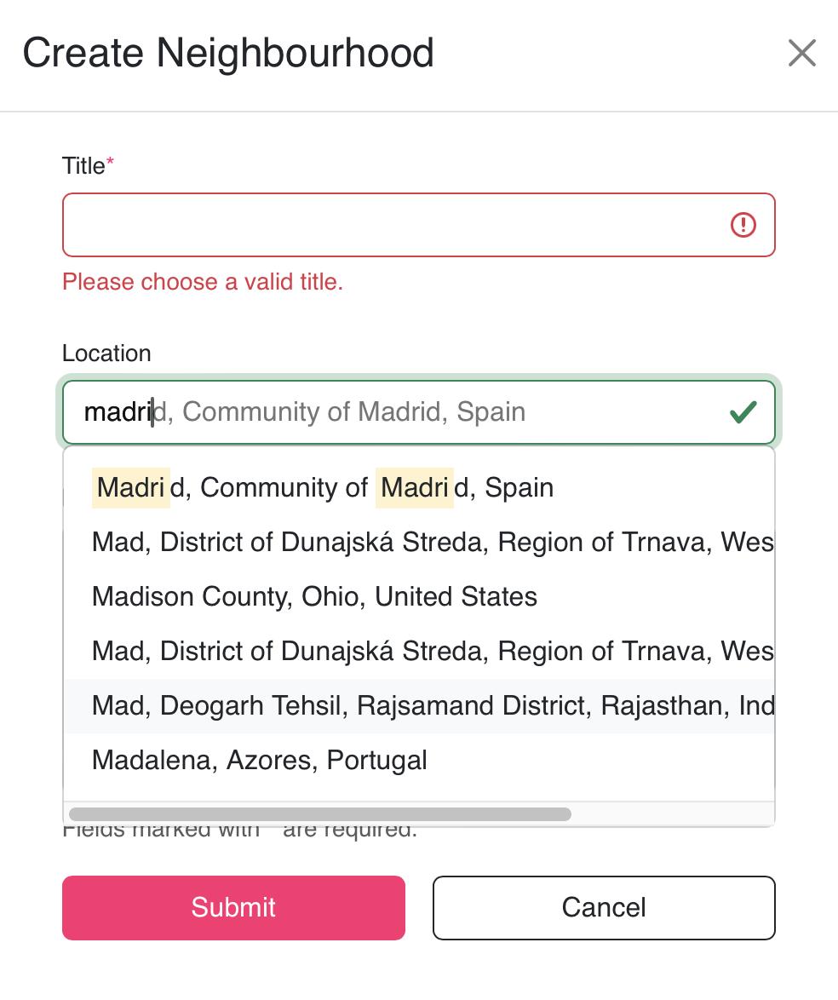

One of the main features of Neighbourhood is that each community created on our platform can be tied to a real-world location. In order to implement this feature in a more manageable way, we decided to split it into multiple parts or "sub-features":

1. Allow admins to add a **valid** address to their neighbourhoods.
   - _Valid_ means that the location's existence can be verified by an external location API. The user cannot input fictive addresses.
2. Browse neighbourhoods on a map:
   - Neighbourhoods would be shown as pins on the map;
   - Each pin also acts as a link to that respective Neighbourhood's page;
   - The map should be centered on the user's current location, provided the user grants permission to access their location.
3. In each Neighbourhood page, show a small map centered on that neighbourhood's location;

To achieve all of the above we needed a map provider. Our research came down to two options: Google Maps or OpenStreetMap. After analyzing the pros and cons of each provider, we decided to opt for OpenStreetMap due to its free and open-source nature.

The implementation of the first step of the plan, to allow users to add a valid address to a neighbourhood, was done with the aid of a _typeahead_ input that asynchronously queries the OpenStreetMap provider, which effectively displays a list of possible addresses based on what the user's input.

{:width="330px" height="330px" style="display:block; margin-left:auto; margin-right:auto"}

To ensure that each `neighbourhood` has a valid address, the user is forced to select a value from the list provided by the OpenStreetMap API. This ensures the integrity of the input location and also provides the latitude and longitude values necessary to properly display the pin on the map.

The next step was to show the location of each neighbourhood on an interactive map. Our initial approach was to retrieve all neighbourhoods and their coordinates from the database, irrespective of their actual location and render them on the map provided by OpenStreetMap. While this approach works fine if you have a small number of neighbourhoods, we considered that it might pose performance issues and long loading times in the case of larger data sets. In reality, the user doesn’t need all neighbourhood locations to be loaded since he/she is only interested in the locations that they can see on the specific part of the map they are on. If the bounds of the map are centered on the city of Madrid, for example, there is no need to load neighbourhoods in Italy.

{:width="500px" height="500px" style="display:block; margin-left:auto; margin-right:auto"}

In order to make this desired behavior a reality, the following sequence of actions is triggered each time the user moves position on the map:

1. Get the coordinates of the current boundaries of the map;
2. Query the database to retrieve the neighbourhoods whose coordinates are within the bounds defined in step 1;
3. Display a pin on the map for each neighbourhood retrieved at step 2.

With this approach, we have multiple requests to the backend server, depending on how many times the user changes position on the map. This solves our initial problem, but creates another one: if the user moves too fast and too often on the map he/she will create too many requests to our backend. To prevent this from happening, we wrapped the event that triggered a request to our API in a debounce function that ensures the user has stopped moving on the map before it sends the request.
